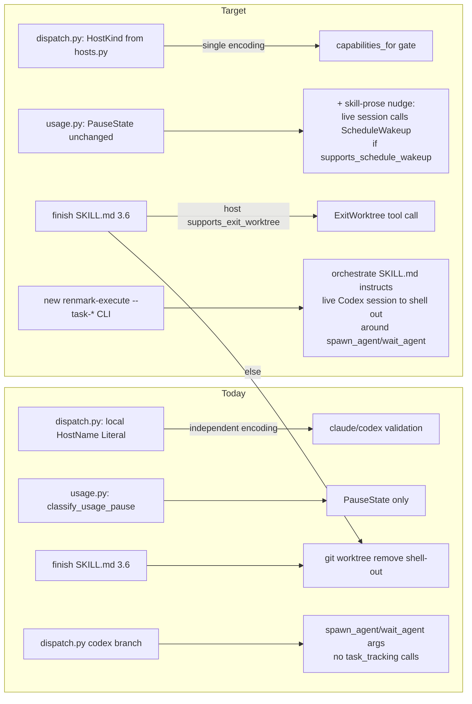

# Stage 7 Target Blueprint — cross-host native-tool leverage

Scope: the 4 approved Improve items only (Discovery Direction Gate,
`modularity-assessment.md`, 2026-08-06). Keep items get no redesign here.

## 0. Flow (before/after host-capability gating)

## 1. Traceability — PRD requirement + classification row per item

| # | Improve item | PRD requirement advanced | classification.md row |
|---|---|---|---|
| 1 | `dispatch.py` HostName → `HostKind` | REQ-23 (host parity — a second independent host-identity encoding is exactly the drift REQ-23 warns against) | Row: `renmark/dispatch.py`'s `HostName` Literal + validation — **Improve** |
| 2 | `ScheduleWakeup` additive nudge in usage-pause path | REQ-30 is the *guardrail* (any change to pause/gate behavior is REQ-30-regulated, not a free feature); the capability itself is not tied to a numbered REQ — it is scoped directly by the Direction Gate's item 2 | Row: **NEW: `ScheduleWakeup` additive nudge in the usage-pause path** — **Improve** |
| 3 | `ExitWorktree` for finish worktree cleanup | REQ-23 (host-native leverage where a real primitive exists), bounded by REQ-30 (must not add a gate or change finish's lane behavior) | Row: `finish/SKILL.md` §3.6 worktree removal shell-out — **Improve** |
| 4 | `task_tracking` wiring into live-Codex dispatch path | REQ-31 (native task tracking, mechanism (i) — closes the Codex gap the PRD's Owner decision already amended the text for) | Row: **Wiring of `renmark.task_tracking` into the live-Codex dispatch path** — **Improve** |

## 2. Per-item design

### Item 1 — `dispatch.py` HostName consolidation

- **Today:** `renmark/dispatch.py:976` defines `HostName = Literal["claude", "codex"]`; `build_host_dispatch_plan` (dispatch.py:1057-1080) validates with a hand-rolled `normalized not in {"claude", "codex"}` check and never imports `renmark.hosts`.
- **Change:** import `HostKind` from `renmark/hosts.py` and replace the Literal + hand-rolled check with `hosts.resolve_host(host)`. Concretely:
  - `HostName` stays as a type alias but becomes `HostName = HostKind` (or dispatch.py keeps accepting `str | HostKind` and normalizes via `hosts.resolve_host`), so `HostDispatchPlan.host: HostName` (dispatch.py:1004) and `HostDispatchCall` callers get `HostKind.CLAUDE_CODE`/`HostKind.CODEX`/`HostKind.UNKNOWN` instead of raw strings.
  - `build_host_dispatch_plan` (dispatch.py:1057-1080): replace `normalized = str(host).strip().lower(); if normalized not in {"claude","codex"}: raise ValueError(...)` with `resolved = hosts.resolve_host(host); if resolved not in (HostKind.CLAUDE_CODE, HostKind.CODEX): raise ValueError(...)`. This picks up `_HOST_ALIASES` (`"claude-code"`, `"claude_code"`, `"openai-codex"`) and `HostKind.UNKNOWN`'s conservative rejection for free, per classification's Rationale.
  - `_build_claude_host_calls` / `_build_codex_host_calls` (dispatch.py:1223, 1268) branch on `host_name` today via the caller's `if/else` at dispatch.py:~1097-1119 — these keep the same two-branch shape, just switch the comparison from string literal to `HostKind` enum member.
- **Does NOT change:** `HostDispatchCall`, `HostDispatchPlan`'s other fields, `_build_claude_host_calls`/`_build_codex_host_calls` bodies, `build_host_dispatch_plan_with_scope`, `enforce_host_agent_dispatch_scope`. `hosts.py` itself is untouched by this item (it's the consolidation target, not the thing being edited).
- **Fallback / what stays:** none needed — this is a pure internal encoding fix; external callers (`orchestrate/SKILL.md:242` passing `host="claude"` or `"codex"` string) keep working unchanged because `resolve_host` accepts plain strings.

### Item 2 — `ScheduleWakeup` additive nudge

- **Precision correction (important):** `renmark/usage.py::classify_usage_pause` (usage.py:312-359) is a pure function — no I/O, no clock read, no host awareness, and its own docstring says "This module reads no clock... purely computes resume_after and delegates to state.usage_limit_pause." It has **no host parameter today** and adding one would be a real signature change. But `ScheduleWakeup` is a tool a *live host session* calls, not something `usage.py`'s Python can invoke — same non-invocation pattern `dispatch.py` already uses for `Agent`/`Workflow` (dispatch.py's own docstring, lines 25-26: "The real Agent/Workflow ... call happens in the host, OUTSIDE this Python module"). So this item is **not a change to `classify_usage_pause`'s call contract** at all.
- **Actual design:**
  - `renmark/hosts.py`: add one new field to `HostCapabilities` — `supports_schedule_wakeup: bool = False` (defaulted so `UNKNOWN` and any future host stay conservative without an edit) — and set it `True` only for `HostKind.CLAUDE_CODE`'s `_CAPABILITIES` entry (hosts.py:46-56), `False` for `HostKind.CODEX` (hosts.py:57-67), matching the External-benchmark's "insufficiently sourced" flag by keeping the default conservative.
  - `renmark/heartbeat.py` (per Modularity §3, "smallest blast radius is `renmark/heartbeat.py` alone"): the print-only `emit_cron` (heartbeat.py:108) and `auto_resume` (heartbeat.py:78) stay exactly as-is — this item does not need a new Python code path there either, since heartbeat.py's cron mechanism serves the *no-live-session* case (Keep, classification row 5) and `ScheduleWakeup` only applies inside a live session.
  - The actual new surface is **skill prose**, not a Python function: wherever a live Claude Code session currently surfaces a usage-limit pause to the user (the skill that calls `classify_usage_pause` and reports the resulting `PauseState`), add an instruction: "if `capabilities_for(host).supports_schedule_wakeup` is true, additionally call `ScheduleWakeup` for `resume_after` before ending the turn — this is a session-scoped nudge, never a substitute for `PauseState`/`pipeline.json`." This mirrors exactly how `orchestrate/SKILL.md:10` already tells a live session to call `TaskCreate`/`TaskUpdate` itself.
- **Does NOT change:** `PauseState`, `state.usage_limit_pause`, `classify_usage_pause`'s signature or return value, `pipeline.json` persistence, `heartbeat.py`'s cron path (all Keep, unconditionally — matches Direction Gate scope item 2's explicit "complementing, never replacing").
- **Fallback:** hosts without `supports_schedule_wakeup` (Codex, Unknown) get no nudge — `PauseState`/cron remain the only resume mechanism, unchanged from today.

### Item 3 — `ExitWorktree` for finish worktree cleanup

- **Today:** `plugin/skills/finish/SKILL.md` §3.6 (finish/SKILL.md:387, confirmed exact line) is pure skill prose with a bash block: `git worktree remove <feature-worktree-path>`, explicitly "self-update and full lanes ONLY," explicitly non-`--force` by default.
- **Change (skill-prose + one new capability field, no new Python module):**
  - `renmark/hosts.py`: add `supports_exit_worktree: bool = False` to `HostCapabilities`, `True` for `HostKind.CLAUDE_CODE` only (the tool is Claude-Code-specific per External-benchmark §1, "native Claude Code tools, introduced v2.1.72").
  - `finish/SKILL.md` §3.6: branch the instruction — "if the resolved host's capabilities report `supports_exit_worktree`, call the native `ExitWorktree` tool for `<feature-worktree-path>` instead of the shell-out below; otherwise use the existing `git worktree remove` command." The existing bash block (list worktrees, `git worktree remove`, delete stale remote branch) stays verbatim as the fallback branch of the same instruction, not deleted.
  - No `renmark/worktree.py` change — confirmed by Modularity §3 and classification: `worktree.py` is deterministic-check/inspection-only and was never the removal call site.
- **Does NOT change:** the `--force` escalation policy (still "only if the user explicitly requests it"), the self-update/full-lane-only scoping, `renmark/worktree.py`, `renmark/state.py`, `renmark/cli/`.
- **Fallback:** Codex-as-host or any host without `supports_exit_worktree` keeps the exact current shell-out, byte-for-byte.

### Item 4 — `task_tracking` wiring into the live-Codex dispatch path

- **Precision correction (the most important one in this blueprint):** the classification's phrasing — "wire `task_tracking.create_or_reuse_task`/`mark_in_progress`/`complete_task` calls around `_build_codex_host_calls`'s payload construction" — is imprecise about *where* those calls can legally live. `build_host_dispatch_plan` and its codex branch `_build_codex_host_calls` (dispatch.py:1268-1299) are pure transport-plan shaping: the enclosing docstring (dispatch.py:1072-1074) states outright "This function performs no dispatch and no ledger/state writes," and `orchestrate/SKILL.md:251` independently confirms `build_host_dispatch_plan_with_scope` "performs no model call, state write, ledger write, or verifier run." `task_tracking.create_or_reuse_task`/`mark_in_progress`/`complete_task` all write `tasks.json` (task_tracking.py's atomic-write pattern). Calling them from inside `_build_codex_host_calls` would violate that documented invariant — this blueprint does **not** put the calls there.
  - Also confirmed by grep: `build_host_dispatch_plan` has exactly one non-test/non-behavior-fixture consumer, `orchestrate/SKILL.md:242` — there is no Python "executor" that walks `HostDispatchPlan.calls` and actually invokes `spawn_agent`/`wait_agent` for a live Codex session. That invocation, like Claude's `Agent`/`Workflow`, happens in the host session itself, outside renmark's Python, exactly as `dispatch.py`'s own module docstring (lines 25-26) already documents for Claude.
  - `orchestrate/SKILL.md:10` already states the parity gap in prose today: for a live Claude Code session, "the executing agent calls its own `TaskCreate`/`TaskUpdate` tools around each dispatch"; `renmark.task_tracking`'s Python mirror is wired only into the codex/subprocess executor path in `renmark/cli/_engine.py` "where no live session exists to call native tools." A live **Codex-as-host** session is a third case this sentence does not cover: it has no native task tool (External-benchmark §2, Keep row) and no existing CLI surface to call `task_tracking` itself.
- **Actual design — two small, concrete changes:**
  1. **New CLI wrapper (real Python code change):** add `--task-create`, `--task-in-progress`, `--task-complete` (names illustrative) flags to `renmark-execute`'s argument parser (`renmark/cli/__init__.py` or wherever the existing subcommands are registered — not yet present per grep of `renmark/cli/_engine.py`, which only re-exports `task_tracking` for the subprocess path, at `_engine.py:16`), each a thin wrapper calling the corresponding `task_tracking.py` function (`create_or_reuse_task`, `mark_in_progress`, `complete_task`) and printing the resulting `TaskRecord` as JSON. This is genuinely new importable/CLI-invokable Python, not skill prose — it's the missing shell-out surface a live Codex session can call.
  2. **Skill-prose instruction (matches the existing Claude-Code pattern):** `orchestrate/SKILL.md` gains a sentence parallel to line 10's Claude-Code sentence: "When this skill is run by a live Codex session acting as host (`hosts.resolve_host()` returns `CODEX`), Codex has no native task tool — call `renmark-execute --task-create/--task-in-progress/--task-complete` around each `spawn_agent`/`wait_agent` pair instead, so REQ-31 mechanism (i) is satisfied for interactive Codex the same way `_wave_loop.py` already satisfies it for the headless subprocess path."
- **Does NOT change:** `task_tracking.py`'s domain logic (evidence guard, self-approval guard, atomic write — unconditionally Keep), `_wave_loop.py`'s existing headless-path calls (untouched, already correct), `_build_codex_host_calls`'s signature or body (no state write added there), `dispatch.py`'s "no dispatch and no ledger/state writes" invariant for `build_host_dispatch_plan`.
- **Fallback:** if a live Codex session's harness doesn't shell out per the new prose (skill-prose adoption is inherently best-effort, same caveat as Claude's own `TaskCreate` adoption), the previous state holds — REQ-31 for interactive Codex stays at today's `partial`/prose-only level, no regression.

## 3. Module contracts, dependency direction, data ownership

- **No new dependency direction is introduced.** Item 1 makes `dispatch.py` import `renmark.hosts` — a new edge, but in the direction the modularity assessment already recommends (`hosts.py` is the canonical source everything should delegate to; it does not import back). Item 4's CLI wrapper makes `renmark/cli/` import `task_tracking.py`, which is already the case in `_wave_loop.py` (`_engine.py:16` already re-exports it) — no new direction, just a second call site in the same module family.
- **Items 2 and 3 add zero new Python dependency edges.** They are skill-prose changes gated by a `HostCapabilities` boolean the skill already knows how to read (the same pattern `lifecycle/preamble.py` uses for `supports_resume`/`supports_clear`/`supports_compact`). `usage.py` does not need to import anything to "support" `ScheduleWakeup` — it never calls it, a live session does.
- **Native-tool call ownership stays exactly where it already is:** Claude/Codex tool invocation (`Agent`, `Workflow`, `spawn_agent`, `TaskCreate`, and now conceptually `ScheduleWakeup`/`ExitWorktree`) is host-invoked, never Python-invoked. `renmark/dispatch.py`'s own module docstring already states this as the established pattern for `Agent`/`Workflow`/`spawn_agent`/`wait_agent`; items 2 and 3 apply the identical reasoning to `ScheduleWakeup`/`ExitWorktree` rather than inventing a new one. Item 4 is the one item that legitimately adds importable Python (the CLI wrapper) — but even that wrapper is called *by* the live Codex session (via shell-out), not by renmark's own orchestration code calling itself.
- **Data ownership unchanged:** `tasks.json` stays sole-owned by `task_tracking.py::write_tasks`'s atomic write (Modularity §5); the new CLI wrapper is a second *caller* of that same writer, not a second writer. `pipeline.json`/pause-state ownership (Modularity §5) is untouched by item 2.

## 4. Migration constraints

- **Baseline to hold:** stage 2's recorded 2101-passing test suite and the ~220 host/dispatch/interaction-targeted tests (`test_hosts.py`, `test_interaction.py`, `test_selector_contract.py`, dispatch.py's own test file) must stay green. Item 1's `HostName`→`HostKind` swap is the only item touching a widely-imported type alias — grep confirms `HostDispatchPlan.host` and `HostDispatchCall` construction are the only internal consumers; external consumers (`orchestrate/SKILL.md:242`) pass plain strings, which `resolve_host` already accepts, so no call-site breakage expected. Additive dataclass fields (items 2, 3) with defaults cannot break existing `HostCapabilities(...)` positional-arg construction only if all existing construction call sites use keyword args — confirmed true at hosts.py:46-78 (all three `_CAPABILITIES` entries use keyword args).
- **REQ-30's 15% ceiling:** none of the 4 items change dispatch policy, gate frequency, or routing logic. Items 2/3 add zero new Owner gates (skill-prose branches on a capability boolean, no new `AskUserQuestion`). Item 4 adds two CLI subprocess calls per Codex-host dispatch (create + complete/in-progress) — bounded, mirrors the existing headless-path cost exactly (already paid there), so no new token/dispatch overhead is introduced on the Claude-host path at all.
- **PRD text:** REQ-31's Owner-amended wording already covers item 4's intent (per classification and prd-acceptance-map); no further PRD edit needed for items 1-3, which are implementation-level fixes to already-approved requirements (REQ-23, REQ-30's guardrail).

## 5. Explicit non-goals

- No new host-adapter abstraction layer, plugin registry, or per-host module split — Direction Gate explicitly rejected these; the modularity assessment found the current shape (`hosts.py` + 4-5 delegating consumers) already adequate for a hypothetical 3rd host.
- No redesign of any Keep item: `hosts.py`/`capabilities_for` itself (beyond the two additive fields), `usage.py`'s `PauseState`/`classify_usage_pause` contract, `heartbeat.py`'s cron mechanism, `task_tracking.py`'s domain logic, `interaction.py::build_selector`, `workflow-fanout.md`/`build_workflow_fanout_args`, `WorkOrder`/G11, `subagent_gate.py` host plumbing.
- `lifecycle/stage.py::_lifecycle_host`'s precedence-order duplication (classification's Unknown-needs-spike row) stays out of scope — a separate, bounded 30-minute future spike, not bundled into this blueprint or its implementation.

---

## Solution Gate — decision (2026-08-06)

**Approved as scoped.** Classification (8 Keep / 4 Improve / 1 out-of-scope
spike) and this blueprint's 4 designs (2 real code changes, 2 skill-prose +
capability-gate changes, the REQ-31 fix corrected from the classification's
original wiring plan to a new CLI-subcommand approach) are Owner-approved.
Zero Remove/Replace, zero incompatibilities. Proceed to Stage 8 (roadmap).
