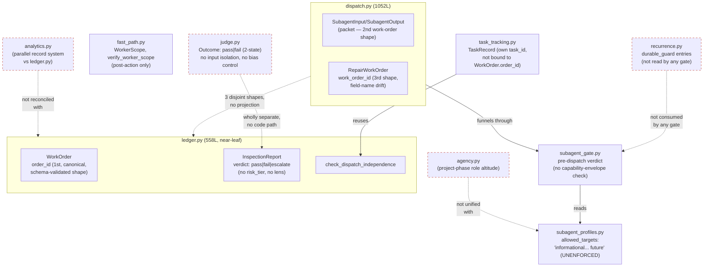
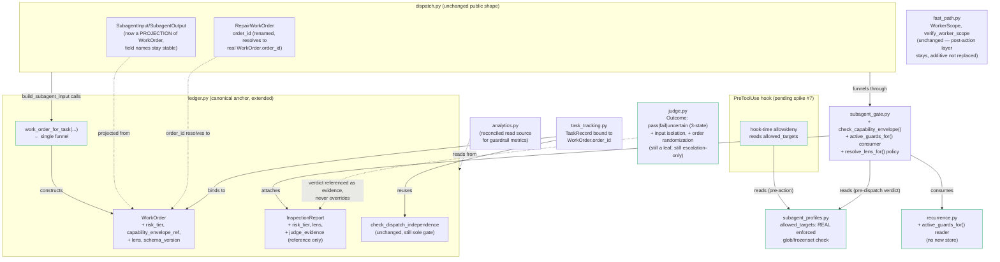

# Stage 7 — Target modular blueprint: governed-orchestration-assurance

Scope discipline (per classification.md's binding rule): only **Replace**
items (3, 11b) and **Improve** items whose stage-5/6 evidence names a
boundary/decomposition/dependency-inversion/interface-stabilization change
are redesigned here. **Keep** items (4, 5, 13, 16, 19, 20, 23a) are carried
forward unchanged — no redesign. **Unknown — needs a spike** items (7, 10b,
18, 22, 24, 28) get a target *slot* (where the answer will live once
resolved), not a design — spikes are Stage 8/9 work, not this stage's.

---

## 1. Desired capabilities and system boundaries

| Capability (traced to PRD AC-id, Stage 3) | Classification decision (Stage 6 item #) | Target boundary |
|---|---|---|
| Canonical work-order/receipt contract (AC-1) | Improve #1 (`ledger.WorkOrder` anchor), Improve #2 (`SubagentInput` projection), **Replace #3** (`RepairWorkOrder` identity field) | `ledger.py` — sole schema owner |
| Task tracker bound to real dispatch (AC-3) | Improve #14 | `task_tracking.py`, consumes `ledger.WorkOrder.order_id` |
| Pre-action capability envelope (AC-2) | Improve #6 (wire existing check), Improve #8 (`allowed_targets` → real check), Unknown-spike #7 (`PreToolUse` hook feasibility), Keep #5 (agent-frontmatter allowlist) | `subagent_gate.py` (mechanism) + `plugin/agents/*.md` (host-enforced allowlist, unchanged) + a `PreToolUse` hook slot (pending spike #7) |
| REQ-30 update release (prerequisite, not a capability) | Improve #9 | `renmark/cost.py` measurement + `PRD.md` REQ-30 text — no module redesign, a release/process gate |
| Risk-tiered inspection + falsification lenses (AC-5) | Improve #10a (`InspectionReport` fields), Unknown-spike #10b (risk classifier), Keep #23a (JSONL mechanism) | `ledger.InspectionReport` (fields) + a new policy function in `subagent_profiles.py`/`subagent_gate.py` orbit (lens selection) |
| Calibrated blind LLM-judge (AC-6) | Improve #11a (mechanism), **Replace #11b** (verdict vocabulary + bias controls) | `judge.py` — stays the sole judge module for both Req 6 and Req 8's eval tier |
| Failure-derived constraint registry (AC-7) | Improve #12 | `recurrence.py` (read-side accessor only), consumed by `subagent_gate.py` |
| Selector/headless enforcement (AC-4) | Improve #15, Keep #16 | `interaction.py` (enforced mode), `config.py::is_headless` unchanged |
| Dispatch scheduling (AC-9) | Improve #17 — **gated**, Unknown-spike #18 | `dispatch.py` wave grouping + `cost.py`/`codex_routing.py`, no work until item 9 (REQ-30 update) closes |
| Context/memory governance (AC-10) | Keep #19, Keep #20, Improve #21, Unknown-spike #22 | `context.py` (unchanged), `memory.py`/`hygiene.py` (extended pruning) |
| Durable events/recovery (AC-11) | Keep #23a, Improve #23b, Unknown-spike #24, Improve #25 | `ledger.py` JSONL (unchanged mechanism, extended fields), `analytics.py` reconciled against `ledger.py` |
| Guardrail metrics (AC-13) | Improve #26 | `analytics.py` aggregators |
| `/renmark:rethink` self-upgrade (Req 12) | Improve #27 — **sequenced last** | REQ-28 pipeline text (PRD change), no module change identified |
| Role-model altitude reconciliation (cross-cutting) | Unknown-spike #28 | ADR note only, no code — ties `agency.py` (Keep, unchanged) to `subagent_profiles.py` (Improve) |

**System boundary statement:** no new top-level package, no new work-order
schema, no new prompt-composition pathway, no new event-log store — carried
forward verbatim from modularity-assessment §9 ("Explicitly NOT justified").
This blueprint's job is to say *which existing module absorbs which
capability*, not to draw a new box.

---

## 2. Redesign: the 2 Replace items + Improve items requiring structural change

Only these five items get an actual before/after shape change. Every other
Improve item (2, 6, 8, 9, 10a, 12, 14, 15, 17, 21, 23b, 25, 26, 27) is an
**additive field or additive function on an unchanged interface** — carried
forward from modularity-assessment §11 without further redesign, listed in
§3 below for completeness but not re-architected here.

### 2.1 Replace #3 — `dispatch.RepairWorkOrder` identity field

**Before:** `RepairWorkOrder(work_order_id, source_inspection_id, severity, scope, description, acceptance_criteria)` — `work_order_id` is an independently-typed string, not a reference into `ledger.WorkOrder`.

**After:**
```
RepairWorkOrder(
    order_id: str,              # ← renamed from work_order_id; IS ledger.WorkOrder.order_id
    source_inspection_id: str,  # unchanged — repair-specific
    severity: str,               # unchanged — repair-specific
    scope: WorkerScope,          # unchanged — already reuses fast_path.WorkerScope (good precedent)
    description: str,            # unchanged — repair-specific
    acceptance_criteria: list[str],  # unchanged — repair-specific
)
```
Only the identity field's *name* changes to match `ledger.WorkOrder.order_id`
semantics; the four repair-specific fields are legitimately distinct and are
kept as-is (classification.md item 3: "field-identity only"). Every
`RepairWorkOrder` MUST reference a real `ledger.WorkOrder.order_id` that was
constructed via `work_order_for_task(...)` (§4 below) — this is what makes
"repair-work-order emission is prose-invoked only" (F2 residual) closeable:
once `order_id` is a real foreign key, a repair can be validated against its
originating work order instead of asserted by convention.

### 2.2 Replace #11b — `judge.Outcome` verdict vocabulary + bias controls

**Before:** `Outcome = Literal["pass", "fail"]`; unparseable/failed judge
responses silently collapse into `fail` + `validation_status: unvalidated`
(an "uncertain-proxy," not a real state); no redaction of Worker
self-assessment/confidence/identity before prompt composition; no
order-randomization for pairwise comparisons.

**After (breaking change to the public `Outcome` type):**
```
Outcome = Literal["pass", "fail", "uncertain"]   # 3rd state, not a 4th field
```
- `uncertain` becomes the honest terminus for a parse failure or genuinely
  ambiguous verdict — replaces the current `fail`-as-uncertain-proxy
  collapse. Any caller pattern-matching on `Outcome` must add the third arm;
  this is deliberately a compile-time-visible breaking change, not a silent
  additive one, because silently defaulting `uncertain` to `fail` behind the
  scenes would just re-hide the same ambiguity the proposal calls out.
- `compose_judge_prompt` gains an input-isolation step: strip Worker
  self-assessment/confidence/identity fields from whatever is handed to the
  judge, before the prompt string is built — not a runtime filter on the
  rendered prompt (which could leak via formatting bugs), but a redaction at
  the data-assembly step upstream of string composition.
- Pairwise/comparison calls gain order-randomization (which side is
  presented first is randomized and recorded, per external evidence F3.1 —
  prompting alone does not fix position bias).
- Mechanism stays: injectable `subagent_runner`, defensive JSON parsing,
  cost-labeled, escalation-only, leaf module (Improve #11a — unchanged).

### 2.3 Improve #1/#2 (work-order reconciliation) — the structural centerpiece

This is the item modularity-assessment §3/§4/§12 names as the hard
prerequisite; it is not a pure field addition (unlike most Improve items),
it is a boundary-stabilization: `dispatch.SubagentInput` stops being an
independently-typed sibling of `ledger.WorkOrder` and becomes a **documented
projection of it**. Full contract in §4.

---

## 3. Module contracts, dependency directions, data ownership, integration boundaries (target state)

Carried forward from modularity-assessment §4/§8/§11, restated as binding
contracts for Stage 8 implementation:

### 3.1 Canonical work-order schema — lives in `ledger.py`, nowhere else

- **Owner:** `renmark/ledger.py`. `schemas.py` stays validate-only for
  *other* canonical JSON files (`lifecycle.json`, `pipeline.json`,
  `limits.json`) and does NOT gain a ledger event schema — this repeats the
  dependency-direction fix the prior `renmark-architecture` rethink already
  made for `schemas.py` ↔ `dispatch.py`, and inverting it here would
  reintroduce the same class of bug.
- **`ledger.WorkOrder` gains additive fields** (not a breaking change to this
  dataclass): `risk_tier: RiskTier | None`, `capability_envelope_ref:
  str | None`, `lens: str | None`, `schema_version: int`. Existing fields
  (`order_id, task, role, file_scope, verifier, is_repair,
  repairs_finding_ref`) are untouched.
- **`dispatch.SubagentInput` becomes a projection, not a sibling.** New pure
  function `ledger.work_order_for_task(task, role, ...) -> WorkOrder`,
  called once inside `dispatch.build_subagent_input` — the one function
  every one of the 6 dispatch call sites (fast-path, feature, debug,
  orchestrate, rethink, resume) already funnels through. `SubagentInput`'s
  own public field names (`task_spec`, `required_files`,
  `verifier_expectations`, etc.) stay **stable** — baseline compat-check #7
  and 5 test files require it — but they are now populated by reading off a
  constructed `WorkOrder`, closing the field-name-drift risk at the
  construction boundary instead of renaming the packet dataclass itself.
- **`RepairWorkOrder`** is fixed per §2.1 — its `order_id` must resolve to a
  `WorkOrder` emitted by `work_order_for_task`.
- **Dependency direction:** `dispatch.py` continues to *consume*
  `ledger.py` via a function-local import (the existing cycle-avoidance
  pattern, already used 5x in `dispatch.py` and once in `lifecycle/stage.py`
  → `schemas.py`) — no new module-level import, no new cycle. `ledger.py`
  gains no new outward dependency; it stays near-leaf (`state._core` only).

### 3.2 `PreToolUse`-hook capability enforcement — plugs into the existing funnel, not a rewrite

- **Mechanism (once spike #7 resolves favorably):** a new pure function
  `subagent_gate.check_capability_envelope(role, requested_scope) ->
  EnvelopeVerdict`, same shape as the existing `SubagentVerdict` (structured
  challenge code, never raises). Called from the same pre-dispatch funnel
  `subagent_gate`'s existing justification check already runs from — this
  makes envelope enforcement a **one-function addition consumed at an
  existing call point**, not a new call site per dispatch path (modularity
  §8's "ONE-function addition, not an N-call-site rewrite" finding, carried
  forward verbatim).
- **`PreToolUse` hook slot:** if spike #7 confirms hook-time metadata-driven
  allow/deny is feasible, the hook reads the same `subagent_profiles.
  ProfileSpec.allowed_targets` field `check_capability_envelope` reads —
  **one source of truth for the envelope, two enforcement moments** (hook =
  pre-action, `check_capability_envelope` = pre-dispatch verdict,
  `fast_path.verify_worker_scope`/`enforce_wave_dispatch_scopes` = post-action
  git-diff check). This is intentional defense-in-depth, not three
  competing envelope definitions — all three read `allowed_targets`, none
  of them re-derive or duplicate it.
- **If spike #7 says the hook contract can't do metadata-driven allow/deny:**
  fall back to post-action-only enforcement (current state, already Keep
  item 5 + Improve item 6) and escalate to Owner per the spike's own stop
  condition — this blueprint does not pre-commit to the hook working.
- **No second prompt-injection pathway:** the envelope check reads
  `allowed_targets` and a dispatch packet's declared scope; it never
  composes new prose into what a subagent sees. Constraint/lens text still
  only reaches a subagent through `dispatch.build_subagent_input`'s existing
  funnel (§3.3, §3.4) — one place text is composed, unchanged from
  modularity §6/§9.

### 3.3 Risk-tier + lens-selection module — policy function, not a new package

- **Lives in the `subagent_profiles.py`/`subagent_gate.py` orbit** (no new
  file forced by this blueprint, but a `resolve_lens_for(work_order) ->
  LensName` policy function is the concrete unit), mirroring `cost.py`'s
  existing "policy, not mechanism" role for model-tier routing — same seam
  shape, different policy domain, explicitly NOT the same function as
  `cost.requires_escalation` (classification item 13, Keep — kept scoped to
  model-tier routing to prevent the two concerns being conflated, per its
  own evidence entry).
- **Risk-tier classifier itself is Unknown-spike #10b** — this blueprint
  reserves the slot (a pure function consuming file scope, target module,
  wave size — deterministic signals, no model call) but does not design its
  internals; that is the spike's deliverable.
- **Lens output attaches to `ledger.InspectionReport`** as an additive field
  (`lens: str | None`, `risk_tier: RiskTier | None`) alongside the existing
  `verdict`/`findings`/`generator`/`dispatch_identity` fields — not a new
  inspection pathway, not a second report type.
- **No new prompt-injection pathway:** lens selection stays out of
  `dispatch.py`'s packet-construction path entirely; a selected lens name is
  metadata attached to the `WorkOrder`/`InspectionReport`, consistent with
  `context.py`'s enforced discipline that dispatch packets carry metadata
  pointers, never composed prose bodies.

### 3.4 Failure-rule registry — read accessor on `recurrence.py`, one new function

- **No new store, no new schema.** `recurrence.py` already has bounded
  (`MAX_ENTRIES = 512`), fingerprinted, `RemediationClass = "patch" |
  "durable_guard"` entries — the proposal's registry IS `recurrence.py`'s
  `durable_guard` entries read back as constraints.
- **New function:** `recurrence.active_guards_for(task_context) ->
  list[Guard]`, consumed only by `subagent_gate.py`'s pre-dispatch check
  (the same funnel as §3.2's envelope check). `subagent_gate.py` gains
  `recurrence` as a new leaf-consuming import (`recurrence.py` itself
  imports only `scan.py`) — no new cycle risk.
- **Distinct from REQ-24:** `recurrence.py`'s existing per-run/fingerprint
  recurrence-prevention role is unchanged; the new reader is additive. Item
  #28's-sibling deferrable spec debt (Req 7 vs REQ-24 relationship) needs an
  ADR before Release E, per prd-acceptance-map — not resolved by this
  blueprint, flagged forward.
- **No second prompt-composition pathway:** constraint text still only
  reaches a subagent through the existing `dispatch.build_subagent_input`
  funnel — `subagent_gate`'s pre-dispatch check consumes guards to decide
  pass/challenge/block, it does not itself compose prompt text.

### 3.5 Judge calibration attaches to `judge.py`; `judge.py`/`ledger.py` InspectionReport split stays SEPARATE (not merged)

**Decision: do not merge `judge.py` into `ledger.py`'s `InspectionReport`
pathway.** Reasoning:

- Peer-findings evidence (classification item 11) confirms `judge.py` and
  `ledger.InspectionReport`/`inspector.md` serve two different proposal
  requirements today with the SAME judge code: Requirement 6 (calibrated
  judging of Worker deliverables) and Requirement 8 (the eval-tier judge for
  behavioral regression). Neither of those consumers is `ledger.py`'s
  `InspectionReport` schema itself — `InspectionReport.verdict` is
  constrained to `VERDICTS = ("pass", "fail", "escalate")` (ledger-level,
  independent-rerun-derived, R-0.4), a fundamentally different provenance
  guarantee (dispatch-independence, not LLM-judged) than a judge verdict.
  Merging them would either (a) let a judge's `pass|fail|uncertain` silently
  become ledger-legal `VERDICTS`, contradicting the proposal's own
  non-goal "an LLM judge... allowed to override deterministic evidence," or
  (b) force `InspectionReport` to grow judge-specific fields it does not
  need for its R-0.4 dispatch-independence job.
- **Target shape:** `judge.py` stays a standalone leaf module. When a
  risk-tiered inspection (§3.3) calls for LLM-judge input (Medium+ tier per
  the proposal), the judge's `Outcome` verdict is recorded as **evidence
  attached to** the `InspectionReport` — an optional `judge_evidence:
  JudgeEvidenceRef | None` field referencing a judge transcript/verdict,
  never as a replacement for or override of `InspectionReport.verdict`
  itself. The independent-rerun-derived ledger verdict remains authoritative;
  the judge verdict is an input the Inspector (human-role or role-scoped
  agent) may weigh, per the non-goal list's explicit prohibition on
  judge-overrides-deterministic-evidence.
- This is an **attachment**, not a merge — `judge.py` and `ledger.py` keep
  their current module boundary; only a reference field is added to
  `InspectionReport`.

---

## 4. Migration constraints

### 4.1 The 9 baseline.md compatibility checks — must stay green through every release in this program

1. `pytest -q` stays at 1970 passed / 0 failed (skip-count delta requires
   documented reason).
2. `fast_path.classify_fast_path`'s 5-signal contract — extend only, never a
   second fast path. None of §2/§3's changes touch `fast_path.py`'s
   classification signals.
3. `fast_path.verify_worker_scope`'s Layer B git-diff semantics unchanged —
   the `PreToolUse` hook (§3.2) is a NEW pre-action layer, additive to, not
   a replacement for, this post-action check.
4. `ledger.check_dispatch_independence` — empty/identical identity always
   raises; unchanged by any item in this blueprint.
5. `ledger.VERDICTS = ("pass", "fail", "escalate")` stays the only
   ledger-legal `InspectionReport.verdict` vocabulary — §3.5 explicitly
   protects this by keeping judge `Outcome` (2-state going to 3-state) out
   of `VERDICTS` entirely; they are different enums for different
   provenance guarantees, never unified into one.
6. `task_tracking.complete_worker_task`'s no-self-approval gate — Improve
   #14 binds task creation to `ledger.WorkOrder.order_id` but does not touch
   the independence-check call itself.
7. REQ-20 metadata-only dispatch (`assert_metadata_only`) — §3.1's
   `SubagentInput`-as-projection change and §3.3/§3.4's "no new
   prompt-injection pathway" constraints are both direct restatements of
   this check; the projection function populates existing packet fields, it
   does not add new prose-carrying fields.
8. REQ-30 orchestration-baseline structural guarantees — see §4.2, this is
   the binding gate on sequencing, not just a passive check.
9. `renmark:inspector` role stays read-only, scoped to `.renmark/ledger/**`
   — §3.5's judge-evidence attachment is read/reference-only from the
   Inspector's perspective; it does not grant the Inspector role new write
   targets.

### 4.2 REQ-30 binding sequencing (from the Exception check-in decision, prd-acceptance-map.md)

**No Critical-tier gate work (Req 5) and no dispatch-scheduling work (Req 9,
item 17/18) may land before the REQ-30 update release (item 9) closes.**
That release must, in order: (a) measure real current per-dispatch baseline
overhead (populating the still-unpopulated Start/Feature/Orchestrate/Rethink
table in `.renmark/memory/orchestration-baseline.md`), (b) formally update
REQ-30 via `/renmark:prd` to name the Critical-tier gate as an allowed named
gate and set a measured overhead budget, (c) require every later release in
this program to demonstrate it stays under that budget. This blueprint's
§3.2/§3.3 designs (capability envelope, risk tier, lens selection) are
therefore implementable in sequence order (a)→(b)→(c)→(d) per the Discovery
Direction Gate: work-order reconciliation (§3.1) and `PreToolUse` wiring
(§3.2) may proceed before the REQ-30 release closes (they are Req 1/2, not
gated); risk-tiering/lens/judge/registry (§3.3-§3.5, Req 5/6/7) and
scheduling (Req 9) may not start implementation until it closes.

---

## 5. Non-goals (verbatim from intake.md's "Explicit exclusions")

- Architecture/operating instructions for external orchestration or business
  systems; content-generation/publishing/campaign/domain-workflow design.
- A new general-purpose distributed scheduler, message broker, database, web
  dashboard, or daemon fleet.
- A permanent multi-agent debate layer or every-perspective-on-every-task
  review.
- An LLM judge treated as truth or allowed to override deterministic
  evidence.
- Prompt-only safety for actions that can be enforced by tools or code.
- Unlimited retries, rework, self-improvement, or autonomous policy
  rewriting.
- Hidden chain-of-thought persistence.
- Reliance on provider prompt caching for correctness.
- A hard dependency on any single model/provider or specific hardware.
- Automatic merge, tag, release, destructive action, external communication,
  or spending without established Owner authority.
- Arbitrary global memory limits copied from another agent without
  Renmark-specific measurement.
- A big-bang rewrite/replacement of the active canonical rethink, fast-path,
  lifecycle, artifact, task, or release systems.
- Changes to a target application's production code, except bounded
  fixtures/example repos required to test Renmark itself.

This blueprint's own designs comply: §3.1-§3.5 are all additive-field/
additive-function changes to already-existing modules (no new package, no
new store, no new scheduler); §3.5 explicitly enforces the
judge-never-overrides-deterministic-evidence non-goal at the schema level;
§4.2 enforces the no-silent-orchestration-regression non-goal via the REQ-30
gate; no item in this blueprint proposes rewriting `dispatch.py`,
`ledger.py`, `fast_path.py`, `lifecycle/`, or `/renmark:rethink` itself —
every module keeps its current public shape plus additive extensions.

---

## 6. Diagrams

### 6.1 CURRENT state



### 6.2 TARGET state



---

## 7. Summary

**Replace items redesigned:** 2 (`dispatch.RepairWorkOrder` identity field
— §2.1; `judge.Outcome` verdict vocabulary + bias controls — §2.2).

**Improve items structurally redesigned (boundary/decomposition/dependency-
inversion/interface-stabilization):** 1 (work-order reconciliation —
`ledger.WorkOrder` as anchor + `SubagentInput` as documented projection —
§2.3/§3.1). All other 13 Improve items are additive-field/additive-function
changes on unchanged interfaces (§3.2-§3.5, listed but not re-architected).

**Most consequential decision:** keeping `judge.py` and `ledger.py`'s
`InspectionReport` as two separate modules connected only by an optional
reference field (§3.5), rather than merging them — this is the one design
choice in this blueprint that, if gotten wrong, would violate the proposal's
own non-goal ("an LLM judge... allowed to override deterministic evidence")
at the schema level rather than just the process level.

---

## Solution Gate — decision (2026-08-04)

**Approved.** Owner approved the classification (stage 6) and blueprint
(stage 7) via AskUserQuestion. Rationale given: reconciles the work-order
schemas, preserves deterministic authority over the LLM judge, and respects
the REQ-30 sequencing constraint. This approves the *solution* — what
changes and what's protected — not yet the roadmap sequencing, which gets
its own Execution Gate at stage 9. Proceeding to stage 8 (incremental
transformation roadmap).
