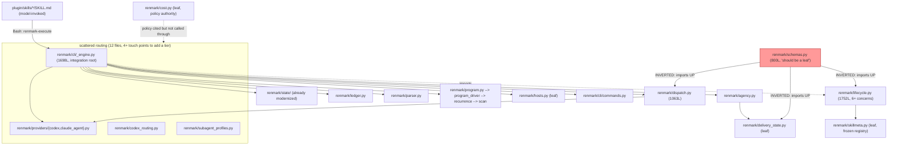
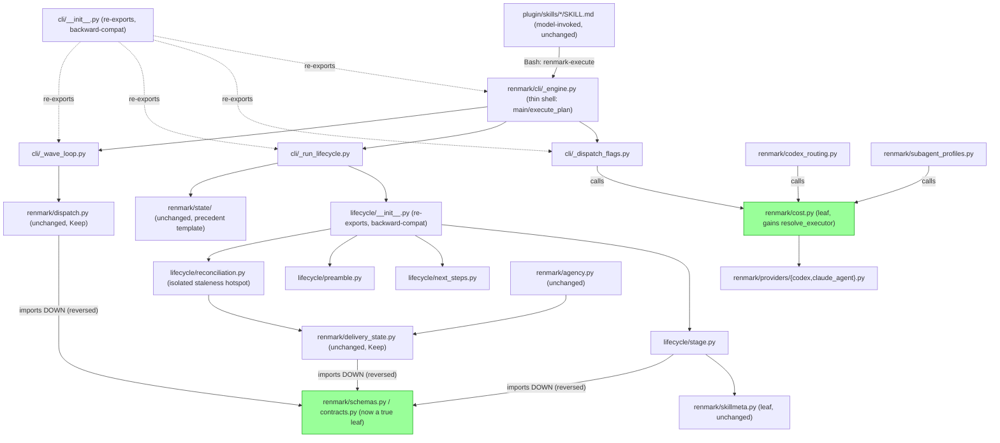

# Target modular blueprint — Stage 7 of `/renmark:rethink` (renmark-architecture)

Scope: **STRUCTURAL-ONLY** modernization per the Discovery Direction Gate
(`modularity-assessment.md` bottom) and the exception check-in in
`intake.md` (behavior-preserving split of `_engine.py`/`lifecycle.py` is
EXEMPT from REQ-30's UPDATE gate; anything touching actual routing/dispatch
POLICY is not). This blueprint redesigns module *boundaries* only, for the
five Stage 6 **Improve** items. It does not touch any of the nine **Keep**
items, does not resolve the one **Remove** item's replacement, and does not
design for the two **Unknown-needs-a-spike** items (numeric baseline
measurement; git-worktree isolation — explicitly out of scope, see
Non-goals).

---

## 1. Module boundaries and contracts

Five boundary sets, one per Stage 6 Improve item. Each states: new
module(s), owning responsibility, dependency direction, data ownership,
public re-export surface, and the PRD/Stage-6 evidence trace.

### 1.1 `renmark/cli/` sub-cluster (was `renmark/cli/_engine.py`, 1698L)

| New module | Owns | Depends on |
|---|---|---|
| `cli/_dispatch_flags.py` | The 5 existing `_dispatch_*` flag-handler functions (already physically isolated) | `state`, `hosts`, `config` (unchanged imports, relocated) |
| `cli/_run_lifecycle.py` | Run-bookkeeping cluster: `_setup_resume_state`, `_begin_run_state`, `_complete_clean_run`, `_handle_run_exit`, `_print_run_summary` | `lifecycle` (via new `lifecycle/__init__.py` re-export), `state.pipeline`, `delivery_state` |
| `cli/_wave_loop.py` | `execute_plan()`'s 394-line body, first extracted into named helpers, then relocated | `dispatch`, `ledger`, `parser`, `providers.{codex,claude_agent}`, `task_tracking` |
| `cli/_engine.py` (retained) | Thin orchestrating shells: `main()`, `execute_plan()` — call into the three modules above | the three modules above only |
| `cli/__init__.py` | Re-exports full existing public surface (same pattern as `state/__init__.py`) | — |

- **Contract**: no call site outside `cli/` changes; `from renmark.cli import execute_plan` / `renmark.cli._engine.execute_plan` (if used) both keep working via `__init__.py` re-export.
- **Traced to**: REQ-30 exemption (`intake.md` exception check-in — structural extraction, same public functions/imports/call sites, before/after test-suite parity); Stage 6 item 1 (`cli/_engine.py` — Improve); Stage 5 §12 Change 2 and §3 (execute_plan is the largest single function found, ~395 lines).
- **Test-coverage caveat carried forward (Stage 5 §8)**: only two test files (`test_engine_resume_crosscheck.py`, `test_engine_budget_and_rollback.py`) map to ~40 module functions — scenario-named, not exhaustive per-function coverage. Migration must inventory per-function coverage before moving code (see §3 Migration constraints).

### 1.2 `renmark/lifecycle/` package (was `renmark/lifecycle.py`, 1752L)

| New module | Owns | Depends on |
|---|---|---|
| `lifecycle/stage.py` | `LifecycleState`, `read_lifecycle`/`write_lifecycle`/`clear_lifecycle`, `STAGES`, `begin_feature`, byte-budget enforcement (`LIFECYCLE_JSON_BYTE_BUDGET`, `LifecycleBloatError`) | `schemas`/`contracts` (post-inversion, §1.3), `skillmeta` |
| `lifecycle/next_steps.py` | `NextSteps`, `next_steps`, `next_recommended`, `_resolve_next`, `_gates_not_run` | `lifecycle/stage.py`, `skillmeta` |
| `lifecycle/preamble.py` | `skill_preamble`, `preamble_tier`, `persist_compact_checkpoint`, `milestone_context_checkpoint`, `_with_*_note` composers | `hosts.capabilities_for`, `lifecycle/stage.py` |
| `lifecycle/reconciliation.py` | `read_legacy_delivery_summary`, `_project_workflow_delivery`, `_workflow_drift_notes`, `milestone_signoff_readiness` — the repeat-offender cross-store staleness hotspot (Stage 5 §4, 3+ CHANGELOG bugs R-0.1/R-0.2/R-0.3) | `lifecycle/stage.py`, `delivery_state`, `state.pipeline` (read-only cross-store reconciliation, isolated to this one file) |
| `lifecycle/__init__.py` | Re-exports full existing public surface (`domain_of`, `skill_preamble`, `next_steps`, etc.) | — |

- **Contract**: every existing `from renmark.lifecycle import X` / `from renmark import lifecycle; lifecycle.X` call site keeps working unchanged. `lifecycle.py` (the file) is replaced by `lifecycle/` (the package) — same import path, same attribute surface.
- **Traced to**: REQ-30 exemption (same as §1.1); REQ-1/REQ-3/REQ-4 "met/protect" rows (Stage 3) — protected by the no-wording-change constraint; Stage 6 item 2 (`lifecycle.py` — Improve); Stage 5 §1 (module docstring names 6+ distinguishable concerns), §4 (reconciliation boundary leak is the acknowledged repeat-offender), §12 Change 3.
- **Explicit design goal carried forward**: isolating `lifecycle/reconciliation.py` reduces the blast radius of the *next* staleness fix to one focused file instead of a 1752-line module — this is a structural risk-reduction outcome, not a logic change (the reconciliation logic itself is relocated verbatim, not rewritten).
- **Test-coverage caveat (Stage 5 §8)**: exactly one test file (`test_lifecycle.py`) maps to ~50 top-level defs across 6+ concerns — coarser safety net than the raw "113 test files, near 1:1" stat implies. Migration must inventory per-function coverage before moving code.

### 1.3 `schemas.py` dependency-direction reversal

- **Change**: `schemas.py` currently imports `CONTRACT_VERSION`, `LEGACY_REF_CAP`, `PROVENANCE_EVENT_CAP`, `SUMMARY_TEXT_LIMIT`, `WORK_PACKAGE_CAP`, `stable_milestone_id`, `stable_work_package_id`, `SCHEMA_VERSION` FROM `delivery_state.py`; `SUBAGENT_OUTPUT_COMPLETION_STATES`/`SUBAGENT_OUTPUT_CONFIDENCE_VALUES`/`SUBAGENT_OUTPUT_FIELDS`/`SUBAGENT_OUTPUT_STATUS_VALUES` FROM `dispatch.py`; `STAGES` FROM `lifecycle.py`.
- **Target**: these become constants owned by `schemas.py` itself (or a new leaf `renmark/contracts.py`, if the constant set is judged large enough to warrant its own module — either satisfies the contract). `delivery_state.py`, `dispatch.py`, and `lifecycle/stage.py` (post-§1.2 split) import them back FROM `schemas.py`/`contracts.py`.
- **Data ownership after reversal**: `schemas.py`/`contracts.py` is the sole owner of shared contract-shape constants; `delivery_state.py`/`dispatch.py`/`lifecycle/stage.py` are consumers, restoring `schemas.py`'s own "zero external dependencies" docstring claim to an accurate statement.
- **Contract**: literal constant values are unchanged; only the import direction changes. No call-site behavior change anywhere (values, not logic, cross the boundary).
- **Traced to**: Stage 6 item 3 (`schemas.py` inverted dependency — Improve, "smallest, highest-value fix"); Stage 5 §2 (confirmed real inversion, lines 38-58 of `schemas.py`) and §12 Change 1; PRD flag 6 (deferrable spec debt, correctly in-scope for a pure module-boundary fix with no behavior change).

### 1.4 Centralized executor/model-tier routing seam

- **Change**: `cost.py` (already the routing-policy authority per `CLAUDE.md`'s own citation, and already a leaf — zero `renmark.*` imports) gains one function: `resolve_executor(task) -> Executor`.
- **Callers migrate to call through it**: `cli/_engine.py`'s `_choose_model()` (relocates into `cli/_wave_loop.py` or `cli/_dispatch_flags.py` per §1.1, whichever owns the call site), `codex_routing.py`, and `subagent_profiles.py`'s role-to-tier mapping all call `cost.resolve_executor()` instead of independently deciding tier eligibility.
- **Dependency direction**: `cost.py` remains a leaf with respect to domain logic (`resolve_executor` reads only `config`/`hosts`-level inputs passed in as arguments — it does not import `dispatch`/`_engine`/`subagent_profiles` to avoid re-introducing a cycle); the *callers* (`cli/`, `codex_routing.py`, `subagent_profiles.py`) depend on `cost.py`, not the reverse.
- **New-tier cost after this change**: one `providers/<tier>.py` adapter + one branch in `cost.resolve_executor` — down from 4+ uncoordinated touch points (Stage 5 §6: `cli/_engine.py`, `plan_lint.py`, `subagent_profiles.py`, `dispatch.py`, `providers/claude_agent.py`, `behavior.py`, `cost.py`, `parser.py`, `work_packages.py`, `codex_routing.py`, `capabilities.py`, `providers/__init__.py`).
- **No policy change**: cheapest-capable-model selection *outcomes* are byte-for-byte identical before/after; `resolve_executor` is a call-graph consolidation, not a new decision function. This is the one item in this blueprint that touches REQ-2 ("cost-routed executor set incl. Fable" — unverified, target "unchanged — protect") and REQ-30's tripwire text most directly; it stays in-scope only because the *outcome* is unchanged and it is a call-graph consolidation, not a routing-policy edit.
- **Traced to**: Stage 6 item 4 (scattered routing — Improve); Stage 5 §6 and §12 Change 4; PRD REQ-2 (target "unchanged — protect") and REQ-30 (protected, exemption applies to structural consolidation only).

### 1.5 Skillmeta-completeness lint gate (optional/stretch — Stage 6 item 5)

- **Change**: extend the existing `plan_lint.py`/`skillgen.py` family with a deterministic check that fails when a `plugin/skills/<name>/` directory has no matching `skillmeta.SKILLS["<name>"]` entry, instead of `domain_of` silently defaulting to `"build"`.
- **No module boundary change** — this is a lint-rule addition inside the existing lint family, not a new package. Included here for completeness per Stage 6's explicit "Stage 7/8 must accept or defer" instruction; **recommendation: defer to a later roadmap release** (not required by any Improve-item's Stage 5/6 evidence for boundary extraction — it is a stretch item, and the four items above already fully satisfy this pass's scope). Carried forward as an explicit backlog item, not silently dropped.
- **Traced to**: Stage 5 §5 (boundary-brittleness/silent-failure-seam finding) and §12 Change 5; Stage 6 item 5 (`classification.md` §5 — corrected 2026-08-03 to give this item its own cited-evidence section, distinct from item 4's routing-scatter evidence; it is no longer only mentioned inside the "Additional components" section).

---

## 2. Items NOT redesigned (the nine Keep items — unchanged)

Per Stage 6 classification, no boundary change proposed for: `renmark/state/`
(the precedent template, unchanged), `renmark/shadow.py`, `renmark/skillgen.py`,
`renmark/dispatch.py`, `renmark/program.py`/`program_driver.py`/`recurrence.py`/
`scan.py`, `renmark/delivery_state.py`, `renmark/config.py`, `renmark/hosts.py`,
`renmark/cost.py`/`renmark/skillmeta.py` (as leaves, aside from `cost.py`
gaining the single `resolve_executor` function in §1.4). The one Remove item
(`context_budget_hint`) is a deletion, not a redesign, and is out of this
blueprint's scope (Stage 8's job to schedule).

---

## 3. Migration constraints — must not break

Carried forward from Stage 2's baseline and Stage 5's test-isolation notes:

1. **Full `pytest -q` suite parity** — every test green before the split must
   stay green after, with identical pass count (no skips/xfails introduced to
   paper over a broken import). Re-run fresh per CLAUDE.md's
   "verification before completion" rule; a suite that passed in an earlier
   wave is not proof for a later one.
2. **Lifecycle stage order preserved** — `STAGES` sequence (`init →
   brainstorm-complete → plan-drafted → plan-validated → created → verified →
   reviewed → documented → ready-to-release → released`) and all stage-order-
   dependent logic in `next_recommended`/`_resolve_next` must be byte-for-byte
   identical after the `lifecycle/` split.
3. **`.renmark/state/` file formats unchanged** — `lifecycle.json` (including
   the 1024-byte `LIFECYCLE_JSON_BYTE_BUDGET` enforcement), `pipeline.json`,
   `delivery.json`/`delivery-archive.json` schemas, byte budgets, and write
   paths must not change shape, only which Python module owns the write.
4. **All 13 pipeline observable outputs unchanged** — CLI stdout/JSON shapes,
   `SubagentOutput` field set (`SUBAGENT_OUTPUT_FIELDS` et al., relocated per
   §1.3 but value-identical), and every `argparse` subcommand's contract stay
   the same; the `plugin/skills/*/SKILL.md` <-> `renmark-execute <subcmd>`
   boundary (Stage 5 §5) is the de facto external API and must not shift.
5. **Backward-compatible imports throughout** — every relocated symbol is
   re-exported from its old top-level path (`cli/__init__.py`,
   `lifecycle/__init__.py`) so no caller outside the two split modules needs
   a source change; this is the `renmark/state/` precedent, proven in this
   codebase already.
6. **Per-function test-coverage inventory before moving code** — per Stage 5
   §8's explicit caveat, do not treat the existing test suite as a complete
   safety net for arbitrary line moves in `_engine.py` (~40 functions, 2
   scenario-named test files) or `lifecycle.py` (~50 defs, 1 test file).
   Inventory coverage per function first; add targeted unit tests for
   uncovered functions before relocating them, not after.
7. **No numeric REQ-30 baseline required for this pass** — per `intake.md`'s
   exception check-in, the still-unmeasured `.renmark/memory/
   orchestration-baseline.md` numeric baseline is NOT a precondition for this
   *structural, behavior-preserving* split (it would be a precondition for
   any change to actual routing/dispatch policy, which this blueprint does
   not include). Measuring that baseline remains a separately budgeted Stage
   8 roadmap item, carried forward, not folded silently into this migration.
8. **No timeline/budget limit stated by Owner** — `intake.md` records
   constraints as "none known yet — no hard timeline/budget/platform/team
   constraint stated." This blueprint imposes no artificial deadline; Stage 8
   sequences the five changes into releases at its own discretion.
9. **Stdlib-only-core non-goal preserved** — none of the five changes add a
   hard third-party runtime dependency to `renmark/` core (per PRD's non-goal
   table, Stage 3); all five are pure Python-file/package reorganizations.

---

## 4. Non-goals (explicit)

- **No skill-prose/UX rewrite.** No `plugin/skills/*/SKILL.md` content
  changes as part of this blueprint; the split modules keep identical
  call-site contracts, so no skill markdown needs to change.
- **No new pipelines/features.** This blueprint adds zero new user-facing
  capability, subcommand, or pipeline stage.
- **No actual routing/dispatch policy change.** §1.4's `cost.resolve_executor`
  seam consolidates the *call graph*, not the *decision logic* — cheapest-
  capable-model outcomes are unchanged. Any future change to tier-eligibility
  logic itself is explicitly NOT covered by this blueprint and would require
  REQ-30's UPDATE gate plus the (still unmeasured) numeric baseline.
- **Git-worktree-per-agent isolation is OUT of scope.** Deferred per Stage 6
  item 10's spike contract (Unknown-needs-a-spike, explicitly excluded from
  this transformation's roadmap by the Owner's Discovery Direction Gate
  decision). This blueprint does not design any module boundary in
  anticipation of worktree isolation.
- **No redesign of the nine Keep items** (see §2) beyond `cost.py` gaining
  one function.
- **No resolution of `context_budget_hint`'s replacement.** Stage 6
  classifies it Remove (dead code deletion); designing a replacement
  enforcement mechanism is explicitly deferred as a future, separately-gated
  feature decision (Stage 6 item 6's own rationale), not this blueprint's job.

---

## 5. Diagrams

Following `/renmark:blueprint`'s convention (`plugin/skills/blueprint/SKILL.md`
Step 3a): Container-granularity Mermaid `flowchart`, one node per major
module the source maps record, edges for data/control flow only — no
component-level (4-level C4) detail, no invented nodes beyond what
`survey.md`/`modularity-assessment.md` already name.

### 5.1 CURRENT state

### 5.2 TARGET state

---

## 6. Summary for orchestrator (Stage 8 input)

Five module-boundary changes total, four required by this pass's evidence
(`cli/` split, `lifecycle/` split, `schemas.py` reversal, `cost.resolve_executor`
seam) and one optional/deferred (skillmeta lint gate — recommend deferring to
a later roadmap release, not required by Stage 5/6 evidence for boundary
extraction). This 4-required + 1-optional/deferred split matches Stage 6's
5 Improve items (`classification.md` §1-§5), each of which now carries its
own dedicated cited-evidence section (survey/PRD-acceptance/external/
modularity) — corrected 2026-08-03 so the skillmeta lint gate item is no
longer counted without its own citation. All five preserve every existing
import path via `__init__.py` re-exports (proven `state/` precedent),
require zero `plugin/skills/*.md` prose changes, and stay inside REQ-30's
exemption per `intake.md`'s 2026-08-03 exception decision. Nine Keep items
and the one Remove item are carried forward unchanged into Stage 8's
roadmap without redesign.
