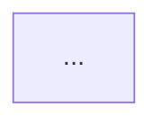

# Spec — `/renmark:blueprint` (prototype/schematic pipeline step)

> Brainstormed 2026-06-05. Phase 3 of renmark, immediately following the PRD
> source-of-truth milestone (v0.6.0). Consumed next by `/renmark:plan`.

## Context

Renmark has a PRD (product source of truth) and a project map
(`.renmark/memory/project-map.md`, repo-understanding layer), but no **visual**
source of truth. This feature adds `/renmark:blueprint`: a rendering/synthesis
layer that turns renmark's existing repo understanding into two living visual
artifacts that evolve with the project the way `PRD.md` does.

It is the visual analog of the PRD: human-owned prose surrounding
machine-generated, regenerable blocks, reconciled on every run rather than
clobbered.

## Goals

1. A standalone `/renmark:blueprint` command that, per project, generates:
   - **`SCHEMATIC.md`** — an architecture/structure diagram (always).
   - **`PROTOTYPE.html`** — a visual UI mockup (**only when the build has a UI**).
2. Both are **living artifacts**: re-running blueprint reconciles the generated
   blocks against current state while preserving human-authored prose.
3. Wired into `/renmark:start` (first blueprint on onboarding) and
   `/renmark:feature` (delta update per feature) — and individually triggerable,
   mirroring the PRD feature's integration shape.
4. Code-only builds → schematic only, no prototype.
5. Zero new runtime dependencies; pure Python + markdown, consistent with the
   existing plugin.

## Non-goals (this build)

- **Deterministic language parsers** that emit diagrams from source — explicitly
  deferred to a future phase. Blueprint is a synthesis layer over
  `project-map.md`, **not** a second repo analyzer.
- **Full 4-level C4** model. Container-level granularity only; multi-level C4
  sync is the known maintenance trap (see research artifact).
- **Image / SVG / PNG export.** Living artifacts must stay diffable text.
- **Full-repo rescan** on each run. `project-map.md` is the sole architecture
  source.
- Product-level *non-goals of the product itself* — those belong in `PRD.md`,
  not here.

## Architecture

### Generation model

```
.renmark/memory/project-map.md  ──┐
.renmark/memory/stack.md (Frontend)─┼─▶ blueprint skill (LLM synthesis) ─┬─▶ Mermaid block ─▶ splice ─▶ SCHEMATIC.md
                                   │                                    └─▶ HTML block (UI+confirm) ─▶ splice ─▶ PROTOTYPE.html
                                   └────────────────────────────────────────────────────────────────▶ git diff review
```

`project-map.md` is the **only** architecture source. Blueprint synthesizes; it
does not scan.

### Living-artifact update model (hybrid, marker-based)

Renmark owns only the content between explicit HTML-comment markers; everything
outside is human-owned and byte-preserved. Pattern borrowed from
`markdown-magic` / `embedme` (no dependency — see research).

`SCHEMATIC.md` shape:

```markdown
# Schematic

## Overview
<human-editable prose — preserved>

## Current Architecture
<!-- RENMARK:GENERATED:SCHEMATIC:START source-sha=<project-map.md hash> -->

<!-- RENMARK:GENERATED:SCHEMATIC:END -->

## Notes / Decisions
<human-editable prose — preserved>
```

`PROTOTYPE.html` shape: a self-contained doc whose `<style>`/`<body>` live
between `<!-- RENMARK:GENERATED:PROTOTYPE:START/END -->`, human prose/comments
outside preserved.

- **Single current-state artifact** — not append-only history.
- Re-run = regenerate the marked block(s) only, in place, idempotently.

### `source_sha` semantics (guardrail)

The `source-sha` recorded in a generated block is the **hash of the source
artifact used for generation** (`project-map.md`), **not** an implication that
blueprint independently scanned the repo. This makes drift detectable as
"project-map advanced past the diagram" and reinforces that blueprint is a
rendering layer.

### Lifecycle posture (guardrail)

Blueprint is an **artifact touchpoint, like PRD — NOT a lifecycle stage.** It:
- may be called standalone and embedded into `start` / `feature`;
- writes `artifact_update` pointers (`schematic`, `prototype`) to lifecycle state;
- MUST NOT advance or complicate the canonical `init → … → released` chain.

Registered in `DOMAIN_BY_SKILL` under the **`build`** domain.

### Write-boundary guardrail (init vs blueprint)

Strict separation of responsibilities:
- **`/renmark:init`** refreshes `project-map.md` and `stack.md` **only**. It MUST
  NOT write `SCHEMATIC.md` or `PROTOTYPE.html`.
- **`/renmark:blueprint`** is the **sole writer** of `SCHEMATIC.md` and
  `PROTOTYPE.html`. The freshness gate may *route to* `/renmark:init` to refresh
  the source map, but blueprint never delegates artifact writing and init never
  produces blueprint artifacts.

## Components

| # | Component | Path | Notes |
|---|---|---|---|
| 1 | Command | `plugin/commands/blueprint.md` | Thin entry, like other `/renmark:*` commands |
| 2 | Skill | `plugin/skills/blueprint/SKILL.md` | Orchestration: freshness-gate → read sources → synthesize → splice → confirm |
| 3 | Splice helper | `renmark/blueprint.py` | `splice_generated_block(text, marker_id, new_content) -> text`; idempotent; missing-marker handling |
| 4 | Templates | `templates/SCHEMATIC.md` + `templates/PROTOTYPE.html` | Skeletons with marker blocks + human sections |
| 5 | Pipeline wiring | `start`, `feature`, `help`, `DOMAIN_BY_SKILL` | Touchpoint integration mirroring PRD |
| 6 | Tests | `tests/test_blueprint.py` | Splice idempotency, prose preservation, UI gate |
| 7 | Docs | `CLAUDE.md`/`AGENTS.md` map + command table, `CHANGELOG.md` | Synced in same commit |

## Control flow & gates

1. **Freshness gate:** if `project-map.md` is missing or stale → **halt and
   route to `/renmark:init`**. Never fabricate architecture.
2. **UI gate:** read `stack.md` Frontend field. If ≠ `none` → infer UI and
   surface a one-line confirm/override. Confirm → prototype; override-no or
   code-only → schematic only. If `stack.md` is missing → fall back to asking
   the UI question directly.
3. **Synthesis:** LLM emits Mermaid (Container granularity) + optional HTML from
   `project-map.md`.
4. **Splice:** generated blocks replaced in place via the marker helper.

## Error handling

| Condition | Behavior |
|---|---|
| `project-map.md` missing/stale | Route to `/renmark:init`, halt — do not fabricate |
| `stack.md` missing | Fall back to asking the UI question directly |
| Existing file **without** markers | Abort with a clear message — never clobber human-managed content |
| Existing file **with** markers | Splice generated block(s) in place |
| File absent | Create from template |
| Prototype declined / code-only | Schematic only; no `PROTOTYPE.html` written |

## Success criteria

1. `/renmark:blueprint` in a code-only project writes `SCHEMATIC.md` with a valid
   Mermaid block and **no** `PROTOTYPE.html`.
2. In a UI project (stack.md Frontend ≠ none, confirmed), it additionally writes
   a self-contained `PROTOTYPE.html` that opens in a browser.
3. Re-running after a manual edit to a human section preserves that edit and
   updates only the generated block (idempotent splice).
4. An existing artifact lacking markers is not clobbered (abort + message).
5. With `project-map.md` missing/stale, blueprint halts and recommends
   `/renmark:init` instead of inventing architecture.
6. Generated blocks record the `project-map.md` source hash.
7. `start` and `feature` invoke blueprint at their integration points; the
   command also runs standalone.
8. `pytest -q` passes; ruff + plugin lint clean. No new runtime dependencies.

## Prior art & references

Full findings: `.renmark/research/2026-06-05-blueprint.research.md`.

- **Marker injection:** reuse markdown-magic's comment-fence *pattern*; build a
  ~30-LOC Python splice helper (no dependency).
- **Living diagrams:** docs-as-code consensus validates Mermaid-in-markdown,
  versioned + diff-reviewed in git. C4 guidance: Container level is sufficient;
  avoid multi-level sync cost.
- **Source reuse:** derive from `project-map.md`, not a fresh scan.

## Scope contract

- **Tech stack:** Python ≥3.10 + Claude Code plugin markdown (no new deps) — the
  existing renmark stack; unchanged by this feature.
- **Deployment:** local plugin install (WSL + Windows), as today.
- **MVP boundary:** schematic + conditional prototype + hybrid update + pipeline
  wiring. Deterministic parsers, multi-level C4, and image export are out.
- **Out of scope:** see Non-goals.
